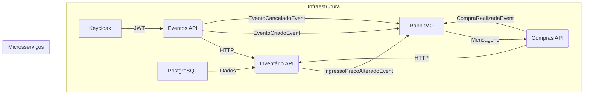

# Arquitetura de Microsserviços EventFlow

**Autor:** Manus AI
**Data:** 04 de Dezembro de 2025

## 1. Visão Geral da Arquitetura

Este documento detalha a migração do projeto monolítico `gestao-eventos` para uma arquitetura de microsserviços orquestrada pelo **.NET Aspire**. A nova arquitetura é projetada para ser escalável, resiliente e manutenível, seguindo os princípios do **Domain-Driven Design (DDD)**.

### 1.1. Componentes da Infraestrutura

| Componente | Tecnologia | Propósito |
| :--- | :--- | :--- |
| **Orquestração** | .NET Aspire | Gerenciamento do ciclo de vida dos serviços em desenvolvimento e auxílio no deploy. |
| **Identidade** | Keycloak | Serviço de Identidade (IDaaS) para autenticação (JWT) e autorização. |
| **Banco de Dados** | PostgreSQL | Persistência dos dados de cada microsserviço em bancos de dados separados. |
| **Mensageria** | RabbitMQ | Comunicação assíncrona entre os microsserviços via Eventos de Domínio. |

### 1.2. Diagrama de Alto Nível

## 2. Contextos Delimitados (Microsserviços)

A arquitetura é dividida em três microsserviços de negócio, cada um representando um Contexto Delimitado do DDD.

### 2.1. EventFlow.Eventos.Api

*   **Responsabilidade:** Dono da agenda e da logística do evento.
*   **Agregado Raiz:** `Evento`.
*   **Fronteiras:** Não gerencia preço ou estoque de ingressos.

### 2.2. EventFlow.Inventario.Api

*   **Responsabilidade:** Dono do estoque e do preço dos ingressos.
*   **Agregado Raiz:** `Ingresso`.
*   **Fronteiras:** Não gerencia o status de pagamento ou o registro da compra.

### 2.3. EventFlow.Compras.Api

*   **Responsabilidade:** Dono da transação financeira e do registro da compra.
*   **Agregado Raiz:** `CompraIngresso`.
*   **Fronteiras:** Não gerencia o estoque ou os detalhes do evento.

## 3. Mapeamento de Comunicação

### 3.1. Comunicação Síncrona (HTTP)

| Fluxo | Serviço A (Cliente) | Serviço B (Servidor) | Propósito |
| :--- | :--- | :--- | :--- |
| **Validação de Capacidade** | **Eventos API** | **Inventário API** | Consulta a contagem de ingressos vendidos antes de reduzir a capacidade. |
| **Reserva de Estoque** | **Compras API** | **Inventário API** | Solicita a reserva transacional do estoque antes de registrar a compra. |

### 3.2. Comunicação Assíncrona (Eventos de Domínio)

| Evento Publicado | Serviço Emissor | Serviço Consumidor | Propósito |
| :--- | :--- | :--- | :--- |
| `EventoCriadoEvent` | Eventos API | Inventário API | Permite que o Inventário crie ingressos para o novo evento. |
| `EventoCanceladoEvent` | Eventos API | Inventário API, Compras API | Bloqueia a venda e inicia o processo de reembolso. |
| `CompraRealizadaEvent` | Compras API | Notificações, Relatórios | Envio de e-mail e atualização de dashboards. |

## 4. Lógica Crítica: Reserva de Ingressos

A reserva de múltiplos ingressos no **Inventário API** é a operação mais crítica. Ela é implementada para ser **atômica** e **resiliente** a alta concorrência.

*   **Atomicidade:** O `ReservarItensTransacional` usa uma **transação de banco de dados explícita** (`BeginTransactionAsync`) para garantir que a reserva de todos os itens seja uma única operação (tudo ou nada).
*   **Resiliência:** A **concorrência otimista** (usando `RowVersion`) é combinada com uma **estratégia de Retry** (5 tentativas) para lidar com conflitos de concorrência (`DbUpdateConcurrencyException`), garantindo a robustez do sistema.

## 5. Referências

*   [.NET Aspire Documentation](https://learn.microsoft.com/en-us/dotnet/aspire/)
*   [Domain-Driven Design Distilled by Vaughn Vernon](https://www.amazon.com/Domain-Driven-Design-Distilled-Vaughn-Vernon/dp/0134434420)
*   [Optimistic Concurrency in EF Core](https://learn.microsoft.com/en-us/ef/core/saving/concurrency)
